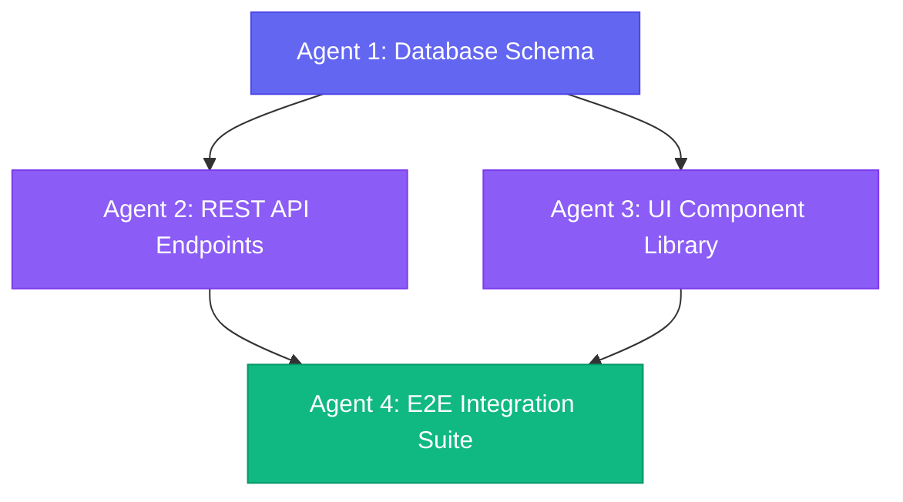

<div align="center">

<br/>


# ⚡ HYPERION

### **The Command Center for Parallel AI Coding Agents**

*Stop juggling 47 browser tabs & scattered terminals. Harness parallel agentic swarms in a single, unified workspace.*

<br/>

[](LICENSE)
[](https://github.com/Hyperion-Workspace/Hyperion/stargazers)
[](https://github.com/Hyperion-Workspace/Hyperion/actions)
[](https://tauri.app)
[](https://nextjs.org)

<br/>

[🌐 Website](https://hyperions.bond) &nbsp;•&nbsp; [📚 Documentation](https://hyperions.bond/en/docs) &nbsp;•&nbsp; [🚀 Quick Start](#-quick-start) &nbsp;•&nbsp; [🐛 Report Bug](https://github.com/Hyperion-Workspace/Hyperion/issues) &nbsp;•&nbsp; [💬 Community](https://github.com/Hyperion-Workspace/Hyperion/discussions)

<br/>


</div>

<br/>

---

## 💥 The Friction

Modern AI-assisted development is fundamentally broken:

```gcode
 ┌─────────────────────────────────────────────────────────────────────────────┐
 │  Terminal (Agent 1) ──► Browser Tab #14 ──► Notes App (Prompts)            │
 │         ▲                                         │                         │
 │         └────── Debug Output ◄── Copy/Paste ──────┘                         │
 └─────────────────────────────────────────────────────────────────────────────┘
                             ❌ CHAOTIC CONTEXT SWITCHING
```

**Hyperion eliminates the noise.** It consolidates terminal PTY grids, Kanban task dispatches, prompt engineering versioning, and multi-agent dependency swarms into **one high-performance native app**.

<br/>

## ⚔️ Paradigm Shift

<table>
<tr>
<th width="50%" align="left">🚫 Traditional Agent Workflow</th>
<th width="50%" align="left">⚡ The Hyperion Way</th>
</tr>
<tr>
<td>

- ❌ Scattered, lost terminal windows
- ❌ Copy-pasting prompts from random scratchpads
- ❌ Zero real-time visibility into parallel execution
- ❌ Constant context bleeding across projects
- ❌ Single-agent bottlenecking

</td>
<td>

- ⚡ **Scoped Terminal Grid** per project context
- ⚡ **Prompt Forge** with integrated version control
- ⚡ **Live Kanban** with direct task dispatching
- ⚡ **Strict Environment Isolation** (Zero leak)
- ⚡ **Agent Swarm** dependency graph orchestration

</td>
</tr>
</table>

<br/>

## 🚀 Quick Start

Launch Hyperion natively in **under 60 seconds**:

```bash
# 1. Clone the repository
git clone https://github.com/Hyperion-Workspace/Hyperion.git

# 2. Navigate to root
cd Hyperion

# 3. Install dependencies (pnpm v10+ required)
pnpm install

# 4. Launch Desktop Client
pnpm tauri dev
```

> **Prerequisites:** Node.js `>=20`, pnpm `>=10`, and [Rust Toolchain](https://www.rust-lang.org/tools/install).

<details>
<summary><b>✨ First Run Walkthrough & Pro Tips</b></summary>
<br/>

1. **Workspace Creation:** Click **`+ Create Workspace`** in the sidebar. Each workspace gets an isolated file & process boundary.
2. **Terminal Grid:** Open split terminal panes; they automatically bind to your project's root path.
3. **Dispatching Tasks:** Drop a task card into the Kanban board and drag it directly onto an AI Agent node to ignite execution.
4. **Live Stream:** Watch token output and file modifications stream real-time directly inside the embedded PTY pane.

</details>

<br/>

---

## 💎 Core Architecture & Capabilities

```
                  ┌──────────────────────────────────────────────┐
                  │               HYPERION SHELL                 │
                  │        Tauri 2 · Desktop & Mobile Native      │
                  └──────────────────────┬───────────────────────┘
                                         │
               ┌─────────────────────────┴─────────────────────────┐
               ▼                                                   ▼
┌───────────────────────────────┐                 ┌───────────────────────────────┐
│        WORKSPACE ENGINE       │                 │       ORCHESTRATION HUB       │
├───────────────────────────────┤                 ├───────────────────────────────┤
│  • Isolated Project Contexts  │                 │  • Swarm Dependency Engine    │
│  • PTY Terminal Manager       │ ◄─────────────► │  • Task Dispatch Kanban       │
│  • SQLite Local State Store   │                 │  • Versioned Prompt Forge     │
└───────────────────────────────┘                 └───────────────────────────────┘
```

<br/>

### 🗂️ Isolated Multi-Workspace System
> *Switch projects instantaneously without state decay or process contamination.*

```
┌─────────────────┬────────────────────────────────────────────────────────┐
│ WORKSPACES      │ ACTIVE WORKSPACE: @hyperion/core                       │
├─────────────────┼────────────────────────────────────────────────────────┤
│ 🟢 auth-service │ [Term 1: Agent Alpha] pnpm test ──► 100% Passed        │
│ ⚪ api-gateway  │ [Term 2: Agent Beta]  building API router endpoints...  │
│ ⚪ mobile-app   │ [Kanban Board]        [2 In Progress]  [5 Completed]   │
└─────────────────┴────────────────────────────────────────────────────────┘
```

<br/>

### 🐝 Agent Swarm Engine
> *Orchestrate complex tasks across specialized agents with DAG (Directed Acyclic Graph) dependencies.*

<div align="center">



</div>

<br/>

---

## 🛠️ Tech Stack Matrix

| Subsystem | Technology | Responsibility |
| :--- | :--- | :--- |
| **Native Shell** | `Tauri 2` + `Rust` | High-efficiency cross-platform system wrapper |
| **Frontend Framework** | `Next.js 16` (App Router) | Static export UI runtime (`output: "export"`) |
| **Design System** | `Tailwind v4` + `shadcn/ui` | Modern OKLCh dynamic color themes |
| **State Engine** | `Zustand` | Client-side reactive persistence |
| **Terminal Core** | `xterm.js` + `node-pty` | Hardware-accelerated terminal emulation |
| **Local Storage** | `SQLite` | High-throughput offline transaction state |

<br/>

---

## 🗺️ Engineering Roadmap

```
Phase 1: Foundations & UI Core         [████████████████████] 100% Completed
Phase 2: Terminal PTY Grid & Scoping   [████████████████████] 100% Completed
Phase 3: Real-Time Agent Streamer      [██████████████░░░░░░]  70% In Progress
Phase 4: Swarm DAG Orchestrator        [████████░░░░░░░░░░░░]  40% In Progress
Phase 5: Plugin Architecture & Cloud   [░░░░░░░░░░░░░░░░░░░░]   0% Scheduled
```

<br/>

---

## 🤝 Contributing

We welcome contributions from developers building the future of AI workflows!

```bash
# Branch out from main
git checkout -b feat/ultra-awesome-feature

# Run Quality Gates before opening PR
pnpm check && pnpm typecheck && pnpm build

# Commit using Conventional Commits convention
git commit -m "feat: add supercharged terminal layout manager"
```

Check out our [Contributing Guidelines](CONTRIBUTING.md) and [Architecture Docs](https://hyperions.bond/en/docs) for deep technical details.

<br/>

---

<div align="center">

## 📄 License & Attribution

Distributed under the **MIT License**. Created with ❤️ by **[Hyperion-Workspace](https://github.com/Hyperion-Workspace)** and open-source contributors.

<br/>

**⭐ Give Hyperion a star if it elevates your AI agent development experience!**

</div>

